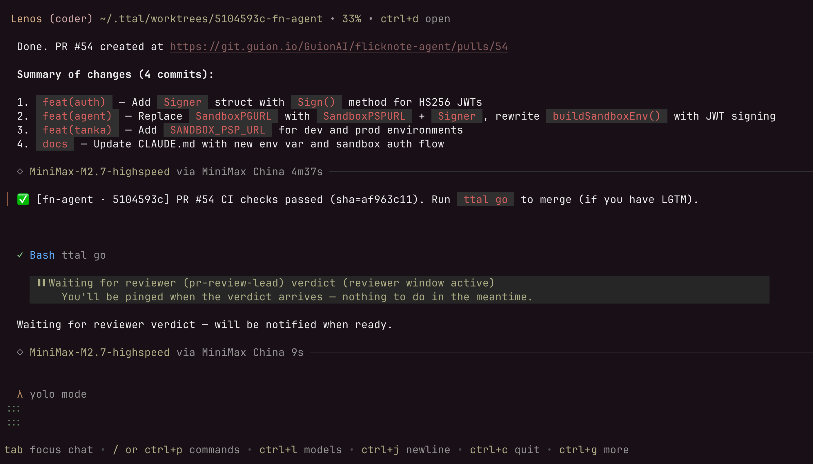

# Lenos

**A terminal-first AI assistant and interactive runtime for the [ttal](https://github.com/tta-lab) ecosystem.**

Lenos is a bash-only interactive shell for ttal agents — multi-model, session-based, built on the Charm ecosystem. It runs directly in your terminal and gives AI agents the tools to read, write, and execute code in a sandboxed environment.

## Features

- **Multi-model support** — Anthropic, OpenAI, Gemini, AWS Bedrock, GitHub Copilot, Hyper, and more
- **Session-based conversations** — persistent, resumable AI sessions per project
- **Agent skills** — composable skill system for customizing agent behavior
- **Charm ecosystem** — built on Charmbracelet's terminal UI libraries
- **ttal native** — designed for the ttal agent runtime and temenos sandbox

## Screenshots



## Installation

```bash
go install github.com/tta-lab/lenos@latest
```

Or download a pre-built binary from the [releases page](https://github.com/tta-lab/lenos/releases).

### Homebrew (via ttal tap)

```bash
brew install tta-lab/ttal/lenos
```

## Usage

```bash
# Run interactively
lenos

# Run non-interactively
lenos run "Summarize the changes in this PR"

# Pipe content in
cat README.md | lenos run "Make this more concise"

# Continue the most recent session
lenos --continue

# Use a custom data directory
lenos --data-dir /path/to/custom/.lenos
```

## Configuration

Lenos looks for a `config.json` file in the following locations (highest priority first):

1. `.lenos/config.json` (workspace config — project-specific overrides)
2. `$XDG_DATA_HOME/lenos/config.json` or `~/.local/share/lenos/config.json` (global data)
3. `$XDG_CONFIG_HOME/lenos/config.json` or `~/.config/lenos/config.json` (global config)

See the [JSON schema](schema.json) for all available options.

### Environment Variables

| Variable | Description |
|---|---|
| `LENOS_GLOBAL_CONFIG` | Override global config directory |
| `LENOS_GLOBAL_DATA` | Override global data directory |
| `LENOS_CACHE_DIR` | Override cache directory |
| `LENOS_SKILLS_DIR` | Override skills directory |
| `LENOS_DISABLE_PROVIDER_AUTO_UPDATE` | Disable automatic provider updates |
| `LENOS_DISABLE_DEFAULT_PROVIDERS` | Ignore embedded default providers |
| `LENOS_DISABLE_METRICS` | Disable telemetry |
| `LENOS_CLIENT_SERVER` | Enable client/server mode |
| `LENOS_PROFILE` | Enable pprof profiling |

## Agent Skills

Agent skills extend what Lenos can do. Place skills in:

- `~/.config/lenos/skills/` (global)
- `.lenos/skills/` (project-local)

Each skill is a directory containing a `SKILL.md` file.

## License

Lenos is licensed under the [Functional Source License, Version 1.1, MIT Future License](LICENSE.md).

## Lineage & Attribution

Lenos is a fork of [Crush](https://github.com/charmbracelet/crush) by [Charmbracelet](https://charm.sh), originally created by [Kujtim Hoxha](https://github.com/kujtimiihoxha) and the Charmbracelet team.

The original Crush project provided the foundation for Lenos: the terminal UI, multi-model architecture, and agent skill system. We are grateful to the original authors for their work.

**Changes from upstream Crush:**
- Module path: `github.com/charmbracelet/crush` → `github.com/tta-lab/lenos`
- Binary name: `crush` → `lenos`
- Data directory: `.crush/` → `.lenos/`
- Config files: `crush.json` → `config.json`
- Environment variables: `CRUSH_*` → `LENOS_*`
- Ignore file: `.crushignore` → `.lenosignore`
- Context files: `crush.md` → `lenos.md`
- Distributed via ttal homebrew tap instead of Charmbracelet channels

The FSL-1.1-MIT license terms are preserved. Original Charmbracelet and Kujtim Hoxha copyrights are retained in [LICENSE.md](LICENSE.md).
