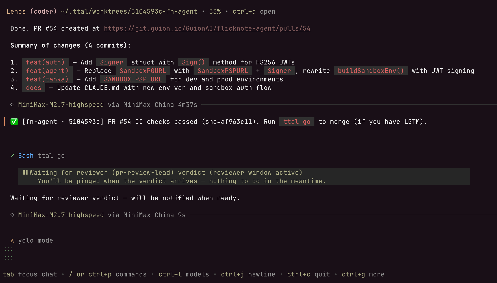

# Lenos

Lenos is a terminal AI coding assistant for the
[ttal](https://github.com/tta-lab) ecosystem.

It runs agents in a real shell because bash is all you need. File edits happen
through CLIs such as `src`; web lookup happens through `web`; skills are found
and read through `skill`; project context comes from `project`. Lenos keeps the
model-facing protocol small: Markdown for prose, `<run>` blocks for bash calls,
and a built-in sandbox around execution.

That simplicity is the point. Compared with native tool-call protocols, the
run protocol avoids provider-specific JSON schemas and typically cuts tool
protocol tokens by 40%-60%. Stable prompt prefixes, compact runtime context,
and the session journal make high cache hit rates easy; in daily use with
DeepSeek V4 Pro, recent cache hit rates have been in the 98-99% range.



## Install

```sh
curl -fsSL https://github.com/tta-lab/lenos/releases/latest/download/install.sh | sh
```

The installer supports macOS and Linux on x86_64 and arm64. It installs Lenos
to `~/.local/bin` and also installs the Organon CLIs that Lenos prompts use:
`src`, `web`, `skill`, and `project`.

Linux sandboxing requires `bubblewrap` (`bwrap`). Install it with your distro
package manager before running Lenos if it is not already present.

Add `~/.local/bin` to your `PATH` if needed:

```sh
export PATH="$HOME/.local/bin:$PATH"
```

## What Lenos Provides

- **Built-in sandbox**: command execution is constrained by the Temenos sandbox
  SDK without a separate daemon.
- **Simple run protocol**: the model replies in Markdown and wraps shell work
  in `<run>` blocks. Lenos executes those blocks and feeds the real result back
  into the next turn.
- **CLI-native tools**: code editing, web lookup, skill discovery, and project
  lookup are regular shell commands, not hidden adapter APIs.
- **High cache locality**: runtime context is injected as stable command/result
  history instead of large changing prose blocks.
- **Agent journal**: task sessions maintain a journal the agent can read after
  compaction, preserving continuity without dragging full history forward.
- **Background jobs**: long-running shell commands can keep running while the
  session stays responsive, with job results fed back into the agent.
- **Session storage**: SQLite-backed sessions can be resumed, continued,
  compacted, and reviewed.
- **Multi-provider models**: Anthropic, OpenAI, Gemini, Bedrock, Copilot,
  Hyper, MiniMax, Vercel, DeepSeek-compatible routes, and other configured
  providers.
- **Agent skills**: local `SKILL.md` directories extend agent behavior without
  changing Lenos itself.
- **ttal-native workflow**: built for worker sessions, PR flow, and the wider
  ttal toolchain.

## Usage

```sh
# Start the TUI in the current project.
lenos

# Run one prompt non-interactively.
lenos run "Summarize the current branch"

# Pipe content into a run.
git diff --cached | lenos run "Review this staged diff"

# Continue the most recent session.
lenos --continue

# Use a model for this session only.
lenos -m deepseek-v4-pro

# Use the configured small-tier model.
lenos --small-model

# Select the small tier and override its model for this session only.
lenos --small-model -m claude-haiku-3.5

# Persist preferred models.
lenos config set-model large deepseek-v4-pro
lenos config set-model small claude-haiku-3.5
```

CLI model flags are ephemeral. They do not write `config.json` and do not leak
into future sessions. Use `lenos config set-model` when you want persistence.

## Configuration

Lenos reads configuration from these locations, highest priority first:

1. `.lenos/config.json`
2. `$XDG_DATA_HOME/lenos/config.json` or `~/.local/share/lenos/config.json`
3. `$XDG_CONFIG_HOME/lenos/config.json` or `~/.config/lenos/config.json`

See [schema.json](schema.json) for all options and
[docs/hooks.md](docs/hooks.md) for lifecycle hooks.

Common environment variables:

| Variable | Description |
|---|---|
| `LENOS_GLOBAL_CONFIG` | Override global config directory |
| `LENOS_GLOBAL_DATA` | Override global data directory |
| `LENOS_CACHE_DIR` | Override cache directory |
| `LENOS_SKILLS_DIR` | Override skills directory |
| `LENOS_DISABLE_PROVIDER_AUTO_UPDATE` | Disable automatic provider updates |
| `LENOS_DISABLE_DEFAULT_PROVIDERS` | Ignore embedded default providers |
| `LENOS_DISABLE_METRICS` | Disable telemetry |
| `LENOS_PROFILE` | Enable pprof profiling |

## Skills

Agent skills live in either global or project-local directories:

- `~/.config/lenos/skills/`
- `.lenos/skills/`

Each skill is a directory with a `SKILL.md` file. The installer provides the
`skill` CLI for finding and managing skill content.

## Sandbox

Lenos links the Temenos sandbox SDK directly. The installer writes a starter
Temenos config at `~/.config/temenos/config.toml` and a starter Lenos config at
`~/.lenos/config.json` when those files do not already exist.

The old `--yolo` and `permissions.allowed_tools` paths are gone. Execution
policy now belongs to the sandbox configuration and the runtime's tool rules.

## Development

```sh
make build
make test
make fmt
make lint-fix
```

Single-package tests use normal Go commands:

```sh
go test ./internal/agent -run TestName
```

## License

Lenos is licensed under the
[Functional Source License, Version 1.1, MIT Future License](LICENSE.md).

## Lineage

Lenos is a fork of [Crush](https://github.com/charmbracelet/crush) by
[Charmbracelet](https://charm.sh), originally created by
[Kujtim Hoxha](https://github.com/kujtimiihoxha) and the Charmbracelet team.

Major changes from upstream Crush include the `github.com/tta-lab/lenos` module
path, the `lenos` binary name, `.lenos` data directories, `LENOS_*`
environment variables, ttal runtime integration, sandboxed command execution,
runtime context templates, session compaction, and the release installer above.

The FSL-1.1-MIT license terms are preserved. Original Charmbracelet and Kujtim
Hoxha copyrights are retained in [LICENSE.md](LICENSE.md).
